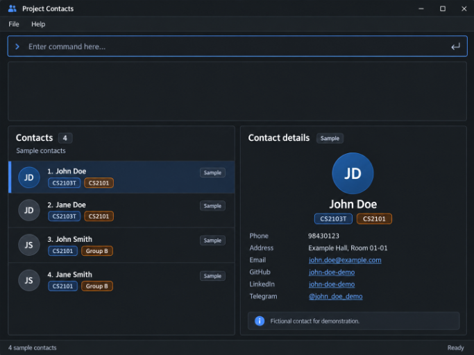

# GitMate

**GitMate** is a desktop application designed for NUS students to organize, manage, and retrieve contact details across multiple project teams and student organizations.

* It is tailored for students taking modules with group project components (such as CS2103/T) and CCAs, who need to keep track of a diverse and changing set of teammates.
* It is **optimized for fast typists** via a Command Line Interface (CLI), while maintaining the benefits of a Graphical User Interface (GUI) created with JavaFX.
* It is written in an **object-oriented programming (OOP)** style in Java, adapted from the [AddressBook Level 3 (AB3)](https://se-education.org/addressbook-level3) brownfield codebase.

---

### Core Value Proposition

GitMate helps NUS students rapidly track and access group project teammates' details through an intuitive, conversational command interface tailored for fast typists.

### Key Features (MVP)

* **Team Segmentation**: Group contacts into distinct, named project teams or CCA committees.
* **Project-Critical Fields**: Store developer- and student-specific fields like GitHub handles, Telegram handles, and project roles alongside standard contact information.
* **Rapid Retrieval**: Search teammates by name, skill, or role instantly across individual teams or the entire roster.
* **Member Status Tracking**: Tag teammate availability (e.g., active tasks, "MIA") to monitor team health during critical project sprints.

---

### Documentation

* **User Guide**: Refer to our User Guide for detailed command formats, cheat sheets, and practical examples.
* **Developer Guide**: Refer to our Developer Guide for architecture diagrams, component breakdown, and design patterns.

---

### Acknowledgments

This project is based on the AddressBook-Level3 project created by the [SE-EDU initiative](https://se-education.org)
