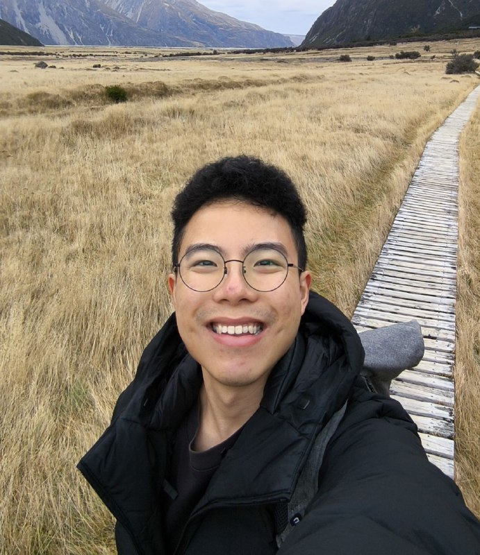
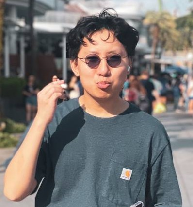
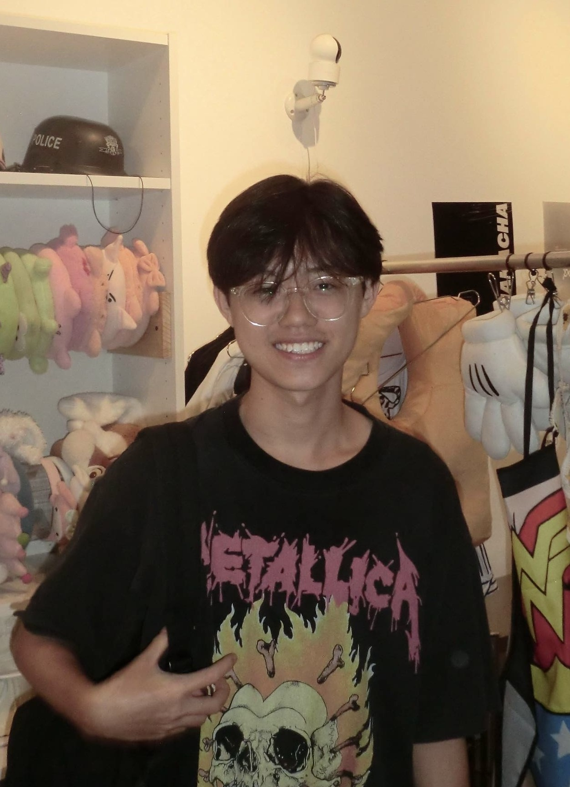
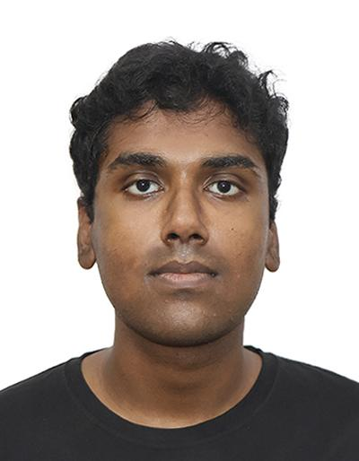

# About Us

We are a team based in the [School of Computing, National University of Singapore](http://www.comp.nus.edu.sg).

You can reach us at the email `seer[at]comp.nus.edu.sg`

## Project team

### Keith Tang

[[github](https://github.com/mannymacman)]

* Role: Project Advisor

### Jonas Koh

[[github](http://github.com/JONASKKE)]

* Role: Team Lead
* Responsibilities: UI

### Ho Wei Xian

[[github](http://github.com/Rio-maker)] 

* Role: Developer
* Responsibilities: Data

### Jean Doe

[[github](http://github.com/junh4nn)]

* Role: Developer
* Responsibilities: Dev Ops + Threading

### Sanjith Gunasekaran

[[github](https://github.com/Sanjith-Gunasekaran)]

* Role: Developer
* Responsibilities: UI
